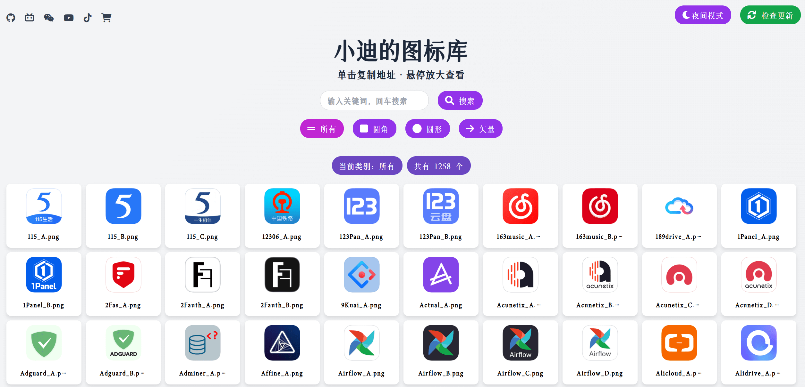
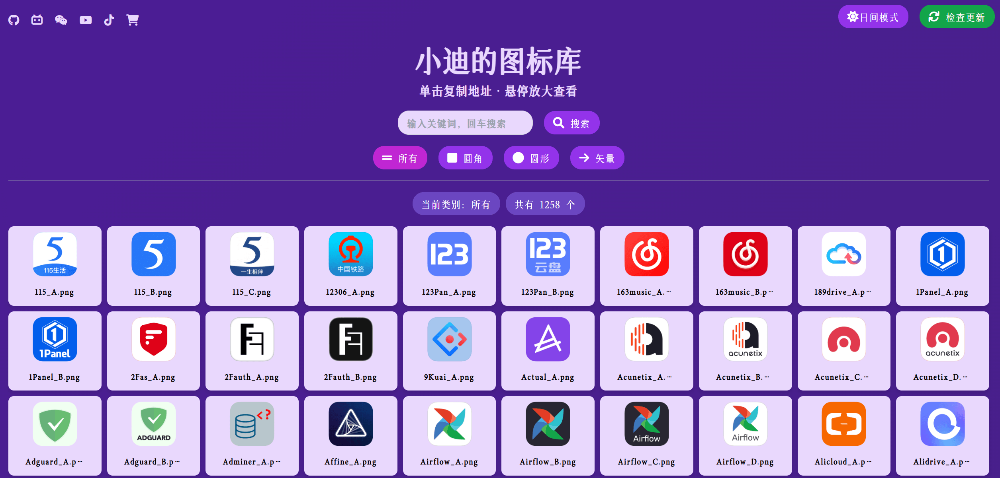
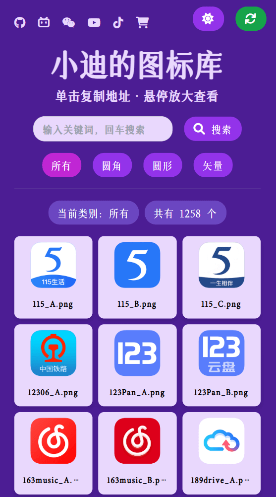
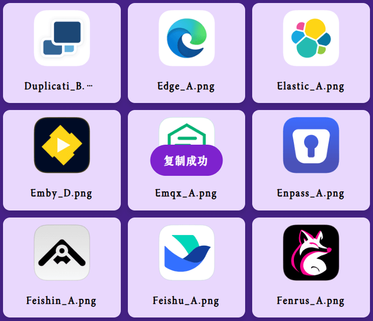
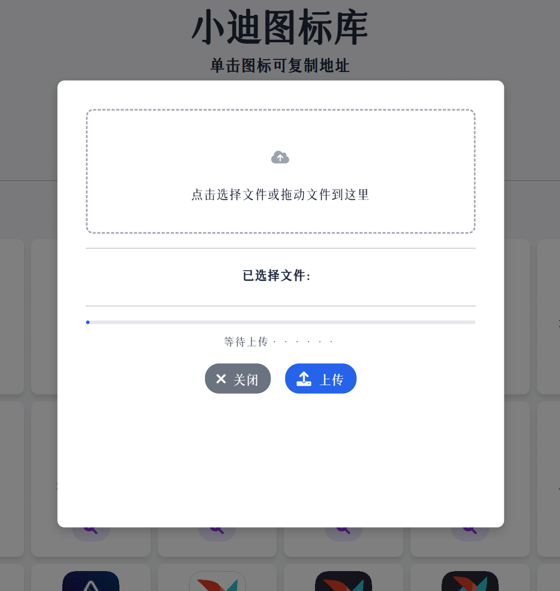

# HD-Icons-Docker - 高清仪表盘图标展示
<div align="center">

<p><em>HD-Icons 图标项目的展示和使用工具</em></p>

[](https://github.com/xushier/HD-Icons-docker/stargazers)
[](https://github.com/xushier/HD-Icons-docker/network)
[](https://github.com/xushier/HD-Icons-docker/issues)
[](https://github.com/xushier/HD-Icons-docker/blob/master/LICENSE)
[](https://www.python.org)

</div>

## 📝 项目简介
**HD-Icons** 项目存储了一些高清图标（**1024x1024**）和矢量图标，地址：https://github.com/xushier/HD-Icons 。

随着 **HD-Icons** 的图标越来越多，图标的展示和查找也变得麻烦起来，于是产生了该项目，用于图标的**展示、搜索、快速复制地址**。

除此之外，图标也会与 **HD-Icons** 保持同步。访问页面的时候**自动检查更新**，每隔一个小时会自动检查更新，也可手动检查更新。有更新时会自动拉取更新的图标。

## 🖼️ 功能预览

在已有图标的基础上，可以自定义上传图标，作为一个**简单的图床**来使用。

## 预览

#### 日间模式
<p align="center">

</p>

#### 夜间模式
<p align="center">

</p>

#### 移动端自适应
<p align="center">

</p>

#### 单击复制地址
<p align="center">

</p>

#### 自定义图片上传
<p align="center">

</p>

## 📖 使用说明

项目已打包为 Docker 镜像，并推送到了 Github 和 DockerHub。Github 镜像为 ```ghcr.io/xushier/hd-icons:latest```，DockerHub 镜像为 ```xiaodid/hd-icons:latest``` 或 ```xushier/hd-icons:latest```，任选一个使用。

首次安装后需**等待图标拉取完毕**，之后才能访问界面，若网络环境不好，可以考虑添加 **ALL_PROXY** 环境变量来设置 **HTTP 代理**。

### docker run 安装：

```bash
docker run -d \
  --name=HD-Icons \
  -p 50560:50560 \
  -v /mnt/user/appdata/HD-Icons:/app/icons \
  --restart=always \
  xushier/hd-icons:latest
```

### docker-compose 安装：

```yml
version: "3"
services:
  HD-Icons:
    image: xushier/hd-icons:latest
    ports:
      - 50560:50560
    volumes:
      - /mnt/user/appdata/HD-Icons:/app/icons
    # environment:
    #   - ALL_PROXY=http://192.168.1.2:7890  # 网络不好可添加 ALL_PROXY 变量设置 HTTP 代理，换一下地址和端口即可。
    #   - CUSTOM_URL=http://xxx.xxx.xxx/icons/HD-Icons  # 自定义复制地址的前缀，若不填且切换到了云端模式则默认为 HD-Icons 项目图标真实地址前缀。
    #   - TITLE=小迪的图标库  # 自定义标题和网页标签页，不填默认为“小迪的图标库”。
```

### Unraid 安装：


## 📝 更新日志

### v4.5

- 修改上传窗口和搜索框黑暗模式下的文字颜色。
- 修复SVG图片缩略图不能完全显示的问题。

### v4.4

- 修复光标指向按钮时，按钮上的图标不显示的问题。
- 修复上传自定义图片时只能上传一张的问题。
- 本地化依赖，解决没有魔法环境时图标加载不出来的问题。
- 修复新更新的图标缩略图不显示的问题。

### v4.3

- 图标按需加载，减少请求。
- 添加加载动画。
- 标题部分下移。
- 修复复制动画闪现 bug。
- 添加前往顶部和底部按钮。

### v4.2

- 添加地址切换功能，地址也可自定义，使用 CUSTOM_URL 环境变量。
- 外部地址移动至页脚。
- 标题可自定义，使用 TITLE 环境变量。
- 网页服务启动使用 gunicorn。

### v4.1

- 展示地址由原图改为缩略图，加快加载速度。
- 修复背景颜色只有第一屏正常的问题。
- 修复复制成功弹窗在放大预览弹窗之上的问题。
- 复制成功弹窗停留时间缩短为1.3秒。
- 删除确认弹窗修改为覆盖整个卡片。

### v4

- 添加浏览器的 PWA(渐进式网页应用) 支持。

### v3

- 悬浮放大修改为放大按钮，避免频繁误触放大；
- 添加自定义图片上传和删除功能。支持多图上传，图片格式支持 ；`png,jpg,jpeg,gif,ico,bmp,svg,tif,tiff,bmp,apng`，删除需要二次确认；

### v2

- 添加自动、手动和定时更新图标功能，同步 HD-Icons 图标库的图标。

### v1

- 图标展示；
- 图标悬浮放大；
- 图标单击复制；
- 图标搜索；
- 日间、夜间模式切换。

## 🤝 赞助（备注：图标）


## 📜 免责声明
(Almost) All product names, trademarks and registered trademarks in the images in this repository, are property of their respective owners. All images in this repository are used by the users of the Dashboard Icons project for identification purposes only.

The use of these names, trademarks and brands appearing in these image files, do not imply endorsement.

---

[](https://star-history.com/#xushier/HD-Icons-docker&Date)
