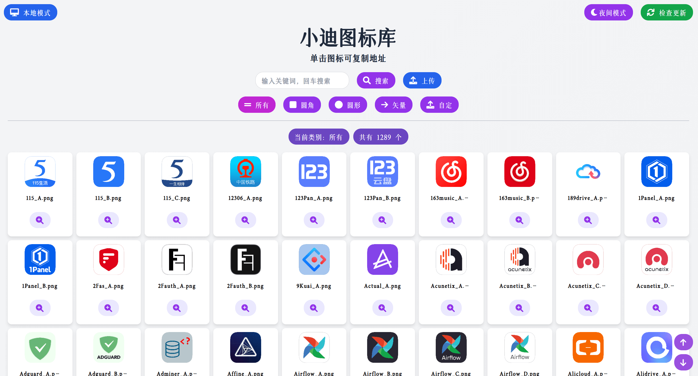

  <h3 align = "center" > 高清仪表盘图标展示 </h3>
  <p align="center">
      
      
      
  </p>

## 简介
**HD-Icons** 项目存储了一些高清图标（**1024x1024**）和矢量图标，地址：https://github.com/xushier/HD-Icons 。

随着 **HD-Icons** 的图标越来越多，图标的展示和查找也变得麻烦起来，于是产生了该项目，用于图标的展示、搜索、快速复制地址。

除此之外，图标也会与 **HD-Icons** 保持同步。访问页面的时候**自动检查更新**，每隔一个小时会自动检查更新，也可手动检查更新。有更新时会自动拉取更新的图标。

## 预览

#### 日间模式



#### 夜间模式


#### 移动端自适应


#### 单击复制地址


## 使用

项目已打包为 Docker 镜像，并推送到了 Github 和 DockerHub。Github 镜像为 `ghcr.io/xushier/hd-icons:latest`，DockerHub 镜像为 `xiaodid/hd-icons:latest` 或 `xushier/hd-icons:latest`，任选一个使用。

首次安装后需**等待图标拉取完毕**，之后才能访问界面，若网络环境不好，可以考虑添加 **ALL_PROXY** 环境变量来设置 **HTTP 代理**。

docker run 安装：

```bash
docker run --name=HD-Icons -p 50560:50560 -v /mnt/user/appdata/HD-Icons:/app/icons --restart=always xushier/hd-icons:latest
```

docker-compose 安装：

```yml
version: "3"
services:
  HD-Icons:
    image: xushier/hd-icons:latest
    ports:
      - 50560:50560
    volumes:
      - /mnt/user/appdata/HD-Icons:/app/icons
    # 若网络环境不好，可以考虑添加以下 ALL_PROXY 环境变量来设置 HTTP 代理，地址和端口换成自己的。
    # environment:
    #   - ALL_PROXY=http://192.168.1.2:7890
```


Unraid 安装：


## 赞助（备注：图标）


## 声明
(Almost) All product names, trademarks and registered trademarks in the images in this repository, are property of their respective owners. All images in this repository are used by the users of the Dashboard Icons project for identification purposes only.

The use of these names, trademarks and brands appearing in these image files, do not imply endorsement.

---

[](https://star-history.com/#xushier/HD-Icons-docker&Date)
